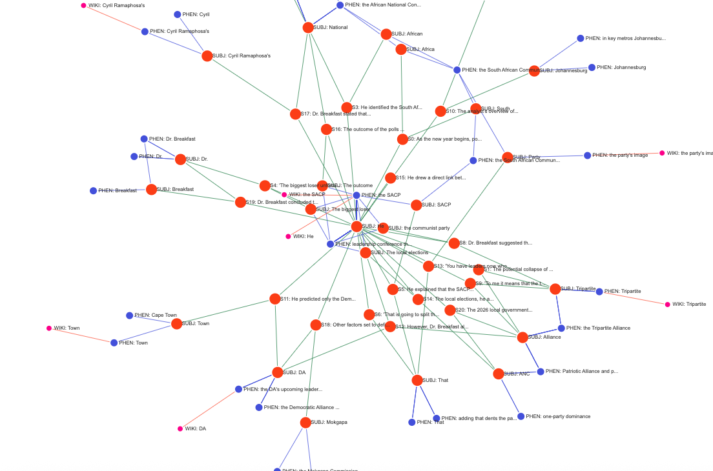

# [LinguaLint](https://www.lingualint.com) : Meanest, Cleanest, NLPness around!

## Table of Contents

- [Overview](#overview)
- [Open Source & Commercial Use](#-open-source--commercial-use)
- [Features](#features)
- [Responsibility Futures Analysis](#responsibility-futures-analysis)
- [Quick Start](#quick-start)
- [Sample Output](#sample-output)
- [Architecture](#architecture)
- [Future Roadmap](#future-roadmap-campaign-intelligence--ml-ops)
- [Enhanced Visual Analytics](#-enhanced-visual-analytics)
- [Testing](#testing)
- [Configuration](#configuration)
- [API Reference](#api-reference)
- [Output Locations](#output-locations)
- [Links & Resources](#links--resources)
- [License](#license)
- [Contributing](#contributing)
- [FAQ](#faq)

## Overview

While tech giants like IBM, Google, and OpenAI dominate the market with massive LLMs and complex engineering services, LinguaLint offers a streamlined alternative.

LinguaLint is a lightweight LLM middleware designed to extract "hashtags" and identify semantic overlaps incoporating Wikipedia's "Blue Words" and enriched sentiment analysis. Built on the linguistic foundations of Wierzbicka's Semantic Primes, and Zipf's Law, LinguaLint offers a more elegant architecture than traditional "Word2Vec" NLP methods. It is currently positioned to function across more than 20 languages.

A modern NLP-powered system for extracting and analyzing event codes from financial documents, news articles, or other english natural language (e.g. 10-K filings, SEC reports, news articles). Built with python3.10, SpaCy, and D3.js visualization. Now featuring **[Responsibility Futures Analysis](https://github.com/jeffy893/riskrunners/tree/dev/2.0/responsibility-futures)** for entity risk assessment.

## 🆓 Open Source & Commercial Use

**LinguaLint is free to use under AGPL-3.0** - perfect for:
- ✅ **Academic research** and educational projects
- ✅ **Internal business use** and analysis
- ✅ **Open source projects** and community tools
- ✅ **SaaS applications** (with source code sharing)

**Need a commercial license?** Contact **jefferson@richards.plus** for proprietary use cases.

**Why AGPL?** We believe in open innovation - if you improve LinguaLint and share it as a service, the community should benefit from your enhancements too. [Learn more about our license choice](#license).

**Questions about licensing?** Check our [FAQ](docs/FAQ.md#license--legal-questions) for common scenarios.


## Features

### 🔍 **Advanced NLP Processing**

* **Subject Extraction**: Identifies proper subjects while avoiding determiners like "The"
* **Semantic Primes**: Implements Wierzbicka's 65 Natural Semantic Metalanguage primes
* **Sentiment Analysis**: Warm/Cold vector analysis for risk assessment
* **Wikipedia Enrichment**: Automatic concept enrichment with Wikipedia summaries
* **Responsibility Futures Analysis**: Calculate Responsibility Ratios (R = Intention/Negligence) for entities

### 📊 **Interactive Visualizations**

* **D3.js Force-Directed Graph**: Interactive network visualization of risk relationships
* **Responsibility Matrix Dashboard**: 4-panel visualization with scatter plots, bar charts, and heatmaps
* **Vector Analysis Heatmaps**: Warm/cold vector analysis for top entities
* **Statistical Summaries**: Distribution analysis and correlation patterns
* **Comprehensive PDF Reports**: Combined PDF with all analyses, visualizations, and data
* **Zoomable Interface**: Pan and zoom for detailed exploration
* **Self-Contained Reports**: No web server required - opens directly in browser
* **Project Management Integration**: Automatic MS Project plans and Gantt charts

### 🌐 **Multiple Interfaces**

* **Web Interface**: Simple browser-based input (`node web-server.js`)
* **MCP Server**: Model Context Protocol server for AI assistants
* **Command Line**: Direct python3.10 processing
* **Batch Processing**: Handle multiple files automatically

## Responsibility Futures Analysis

LinguaLint now includes advanced **Responsibility Futures Analysis** that calculates entity responsibility ratios using warm/cold vector analysis. This feature provides:

### 🔬 **Methodology**

* **Responsibility Ratio (R)**: Calculated as R = Intention Score / Negligence Score
* **Intention Score**: Derived from warm vectors (Positivity × 0.4 + Engagement × 0.4 + Optimism × 0.2) × 100
* **Negligence Score**: Derived from cold vectors (Negativity × 0.5 + Risk × 0.3 + Uncertainty × 0.2) × 100

### 📊 **Risk Assessment Levels**

* **Very Low Risk**: R > 10 (Highly responsible, minimal risk)
* **Low Risk**: 5 < R ≤ 10 (Generally responsible)
* **Moderate Risk**: 2 < R ≤ 5 (Balanced responsibility)
* **High Risk**: 1 < R ≤ 2 (Concerning responsibility levels)
* **Very High Risk**: R ≤ 1 (High risk, negligence exceeds intention)

### 📈 **Generated Visualizations**

* **Responsibility Matrix Dashboard**: 4-panel visualization with scatter plots, bar charts, pie charts, and bubble charts
* **Vector Analysis Heatmaps**: Warm and cold vector analysis for top entities
* **Statistical Summary**: Distribution analysis, correlations, and box plots
* **Interactive HTML Reports**: Professional reports with embedded visualizations and methodology

### 🎯 **Use Cases**

* **Entity Risk Assessment**: Identify high-risk entities in financial documents
* **Sentiment Analysis**: Track intention vs negligence patterns over time
* **Compliance Monitoring**: Flag entities with concerning responsibility ratios
* **Investment Analysis**: Assess management responsibility in 10-K filings

## Quick Start

### 1. Installation

```bash
# Clone repository
git clone git@github.com:jeffy893/lingualint.git
cd lingualint

# Install dependencies
python3.10 -m pip install -r requirements.txt
python3.10 -m spacy download en_core_web_sm

# Install Node.js dependencies (for web interface)
npm install

```

### 2. Run Web Interface

```bash
# Start web interface
node web-server.js

# Open browser to http://localhost:3001
# Paste your 10-K risk factor text and click "Extract Risk Factors"

# To stop the server: Ctrl+C
# If port remains occupied after stopping:
lsof -ti:3001 | xargs kill -9
# Or kill all node processes:
killall node

```

### 3. Run MCP Server (for AI Assistants)

```bash
# Start MCP server
python3.10 server.py

# Configure in Claude Desktop (claude_desktop_config.json):
{
  "mcpServers": {
    "lingualint": {
      "command": "python3.10",
      "args": ["server.py"],
      "cwd": "/path/to/lingualint"
    }
  }
}

```

### 4. Command Line Usage

```bash
# Direct processing (now includes responsibility analysis)
python3.10 run.py "Your risk factor text here..."

# Process from file
python3.10 run.py --file input.txt

# Generate standalone responsibility analysis
python3.10 src/responsibility_analyzer.py extraction_results.json

# Generate responsibility visualizations
python3.10 src/responsibility_report_generator.py responsibility_analysis.json

# Direct import
python3.10 -c "
from src.nlp_processor import ModernNLPProcessor
processor = ModernNLPProcessor()
results = processor.process_text('Your risk factor text here...')
print(f'Extracted {len(results[\"_source\"][\"subjects\"])} subjects')
"

# Generate HTML report
python3.10 src/report_generator.py extraction_results.json -o report.html

```

## Sample Output

### JSON Structure

```json
{
  "_source": {
    "sentences": [
      {
        "sentence": "The COVID-19 pandemic has materially adversely affected our business operations.",
        "warm_vector": [0.05, 0.12, 0.08],
        "cold_vector": [0.23, 0.45, 0.67]
      }
    ],
    "subjects": [
      "COVID-19 pandemic",
      "business operations",
      "our company"
    ],
    "phen": [
      "materially adversely affected",
      "business operations",
      "pandemic impact"
    ],
    "wiki": [
      {
        "wiki_search_content": "COVID-19 pandemic",
        "wiki_url": "https://en.wikipedia.org/wiki/COVID-19_pandemic",
        "wiki_summary": "The COVID-19 pandemic is an ongoing global pandemic..."
      }
    ]
  }
}

```

### HTML Report Features


* **Interactive D3.js Graph**: Zoomable network visualization
* **Subjects Grid**: Organized display of extracted subjects
* **Sentiment Vectors**: Warm (Positivity, Engagement, Optimism) vs Cold (Negativity, Risk, Uncertainty)
* **Wikipedia Integration**: Enriched concepts with summaries and links

### Project Management Integration

* **MS Project CSV**: Compatible project plan files
* **Gantt Charts**: Visual timeline with resource allocation
* **Risk-Based Tasks**: High-risk sentences converted to action items
* **3-Phase Structure**: Research → Mitigation → Implementation

## Architecture

### Modern NLP Pipeline

```
Input Text → SpaCy Processing → Subject Extraction → Semantic Primes → Wikipedia Enrichment → JSON Output → HTML Visualization

```

### Key Components

* **`src/nlp_processor.py`**: Core NLP processing with SpaCy
* **`src/wikipedia_enricher.py`**: Wikipedia integration
* **`src/report_generator.py`**: D3.js visualization generator
* **`src/responsibility_analyzer.py`**: Responsibility Futures Analysis engine
* **`src/responsibility_report_generator.py`**: Enhanced HTML reports and PNG visualizations
* **`src/pdf_generator.py`**: Comprehensive PDF report generation with all analyses
* **`server.py`**: MCP server for AI assistant integration
* **`web-server.js`**: Web interface for browser access
* **`run.py`**: Simple CLI runner with integrated responsibility analysis and PDF generation

### Replaced Legacy Components

* ❌ Java JAR execution → ✅ python3.10 SpaCy NLP
* ❌ Talend ETL processes → ✅ Direct python3.10 processing
* ❌ Shell script orchestration → ✅ Integrated python3.10 pipeline
* ❌ SQLite intermediate storage → ✅ Direct JSON output

## Future Roadmap: Campaign Intelligence & ML Ops

Moving beyond static analysis, the next phase of LinguaLint transforms raw JSON data into actionable campaign plans and utilizes vector databases for anomaly detection across millions of documents.

### 1. Automated Campaign Canvas (JSON to MS Project)

We can now transform extracted "warm/cold" vectors into a SEO content strategy. The following logic maps sentiment to content tasks:

* **Research Phase:** Automatically schedules tasks to review extracted `wiki` links.
* **Drafting Phase:** * High `warm_vector` sentences → Generate "Diplomatic/Opportunity" posts.
* High `cold_vector` sentences → Generate "Risk Analysis/Market Warning" posts.


* **Publishing Phase:** Visual asset creation based on `subjects`.

**Proposed Module:** `src/generators/campaign_planner.py`

```python
# ... (Script logic to generate MS Project CSV)
# Key Logic:
if warm_score > 0.05:
    task_name = f"Draft 'Diplomatic Update' Post based on: {sentence[:30]}..."
    resource = "Copywriter"
elif cold_score > 0.05:
    task_name = f"Draft 'Geopolitical Risk' Post based on: {sentence[:30]}..."
    resource = "Risk Analyst"

```

### 📊 Enhanced Visual Analytics

The [Responsibility Futures](https://github.com/jeffy893/riskrunners/tree/dev/2.0/responsibility-futures) Engine now generates high-resolution PNG visualizations alongside the HTML reports, providing immediate insight into the "Social Capital" of extracted entities in a final PDF report.

#### 1. Responsibility Matrix Dashboard

A multi-panel view containing the **Risk Assessment Scatter Plot** (Intention vs. Negligence) and entity rankings. This visualizes the quantifiable social credit system, moving beyond FICO scores to measure scope capital.


* *Features: Risk level coloring, visibility bubble charts, and top performer rankings.*

#### 2. Vector Analysis Heatmaps

Visualizes the underlying sentiment drivers. **Intention (I)** is mapped from warm vectors (Positivity, Engagement, Optimism), while **Negligence (N)** is derived from cold vectors (Negativity, Risk, Uncertainty).


* *Features: Warm/Cold vector breakdowns identifying specific drivers of high or low R-scores.*

#### 3. Statistical Summary

Provides the mathematical validation of the analysis, showing the distribution of R-Ratios across the dataset and the correlation between intention and negligence.


* *Features: R-Ratio histograms, box plots by risk category, and mention frequency distributions.*


### 2. ML Ops & Vector Database Architecture

To detect "Black Swan" events or shifting narratives across thousands of news events, LinguaLint is designed to integrate with vector-native databases.

**Recommended Stack:**

* **Database:** **Elasticsearch (ELK)** or **OpenSearch**.
* *Why:* Native support for JSON documents + `dense_vector` types for our warm/cold arrays.


* **Alternative:** **Weaviate** or **Pinecone** for pure vector search performance.

**Machine Learning Capabilities:**

1. **Anomaly Detection (The "Black Swan" Finder):**
* *Algorithm:* Isolation Forest or One-Class SVM.
* *Function:* Monitors the `warm_vector` and `cold_vector`. If a document appears with a sentiment vector that deviates significantly from the historical cluster (e.g., a "Warm" update in a historically "Cold" conflict zone), it flags the event as an anomaly.


2. **Narrative Clustering:**
* *Algorithm:* HDBSCAN or K-Means.
* *Function:* Clusters documents by `subjects` and vector proximity to identify evolving storylines (e.g., grouping all events related to "Gaza Ceasefire" vs "Syria Leadership").


## Testing

```bash
# Run comprehensive test suite
python3.10 -m pytest tests/

# Test specific functionality
python3.10 tests/test_nlp_processor.py

# Run with coverage
python3.10 -m pytest tests/ --cov=src

```

### Test Coverage

* ✅ Subject extraction accuracy (avoids "The" as subject)
* ✅ Semantic primes detection ("BECAUSE", "IF" relationships)
* ✅ JSON schema compatibility with D3.js visualization
* ✅ Wikipedia enrichment functionality
* ✅ Sentiment vector calculation

## Configuration

### Requirements

* **Python 3.10+**
* **SpaCy English model**: `en_core_web_sm`
* **Node.js** (for web interface)
* **Internet connection** (for Wikipedia enrichment)

### Optional Features

* **Email Reports**: Configure SMTP settings in `server.py`
* **Batch Processing**: Process multiple files automatically
* **Custom Semantic Primes**: Extend Wierzbicka's 65 primes

## API Reference

### ModernNLPProcessor

```python3.10
from src.nlp_processor import ModernNLPProcessor

processor = ModernNLPProcessor()
results = processor.process_text(
    text="Your risk factor text...",
    tag="analysis_tag",
    email="analyst@company.com",
    enrich_wikipedia=True
)

```

### MCP Tools

* **`extract_risk_factors`**: Main extraction tool
* **`email_report`**: Optional email functionality

## Output Locations

All generated files are saved to:

```
./reports/
├── extraction_YYYYMMDD_HHMMSS.json                    # Raw extraction data
├── extraction_YYYYMMDD_HHMMSS_responsibility_analysis.json  # Responsibility analysis data
├── report_YYYYMMDD_HHMMSS.html                        # Interactive D3.js visualization
├── responsibility_report_YYYYMMDD_HHMMSS.html          # Responsibility analysis report
├── responsibility_matrix_YYYYMMDD_HHMMSS.png           # Matrix dashboard visualization
├── vector_analysis_YYYYMMDD_HHMMSS.png                # Vector analysis heatmaps
├── statistical_summary_YYYYMMDD_HHMMSS.png             # Statistical summary plots
├── project_plan_YYYYMMDD_HHMMSS.csv                   # MS Project compatible plan
└── gantt_chart_YYYYMMDD_HHMMSS.png                    # Gantt chart visualization

./lingualint_analysis/                                       # Super folder for all analyses
└── analysis_YYYYMMDD_HHMMSS/                          # Individual analysis package
    ├── lingualint_analysis_YYYYMMDD_HHMMSS.pdf           # **COMPREHENSIVE PDF REPORT**
    ├── combined_report_YYYYMMDD_HHMMSS.html           # Combined HTML document
    ├── extraction_YYYYMMDD_HHMMSS.json                # Raw extraction data (copy)
    ├── extraction_YYYYMMDD_HHMMSS_responsibility_analysis.json  # Responsibility data (copy)
    ├── project_plan_YYYYMMDD_HHMMSS.csv               # Project plan (copy)
    ├── responsibility_matrix_YYYYMMDD_HHMMSS.png       # Matrix visualization (copy)
    ├── vector_analysis_YYYYMMDD_HHMMSS.png            # Vector analysis (copy)
    └── statistical_summary_YYYYMMDD_HHMMSS.png         # Statistical plots (copy)

```

## Links & Resources

* **[LinguaLint Website](https://www.lingualint.com)**
* **[Risk Runners](https://riskrunners.com)** - Public Company Risk Factors
* **[Jefferson.Cloud](https://jefferson.cloud)** - Socialize
* **[Richards.Systems](https://richards.systems)** - Decode
* **[Wiki.Richards.Systems](https://wiki.richards.systems)** - Knowledge Base
* **[Richards.Plus](https://richards.plus)** - Consult

## License

LinguaLint is licensed under the **GNU Affero General Public License v3.0 (AGPL-3.0)**.

### Why AGPL-3.0?

We chose AGPL-3.0 to ensure that LinguaLint remains open source and benefits the entire community:

**🔓 Freedom & Transparency**
- **Complete Source Access**: You can view, modify, and distribute the source code
- **No Vendor Lock-in**: You're never dependent on a single company or service
- **Community-Driven**: Improvements benefit everyone, not just commercial entities

**🤝 Copyleft Protection**
- **Network Services**: If you run LinguaLint as a web service, users must have access to your source code
- **Derivative Works**: Any modifications must also be open source under AGPL-3.0
- **Commercial Use**: You can use LinguaLint commercially, but must share improvements

**🚀 Innovation Incentive**
- **Collaborative Development**: Encourages sharing improvements rather than hoarding them
- **Academic Research**: Perfect for research institutions and academic projects
- **Enterprise Adoption**: Large organizations can use it while contributing back to the community

### Commercial Licensing

If AGPL-3.0 doesn't fit your use case, we offer **dual licensing**:

- **Open Source**: Free under AGPL-3.0 (share your improvements)
- **Commercial**: Proprietary license available for closed-source applications

Contact us at **jefferson@richards.plus** to discuss commercial licensing options.

### License Compatibility

AGPL-3.0 is compatible with:
- ✅ **GPL-3.0** and **GPL-2.0+** projects
- ✅ **Academic and research** use
- ✅ **Internal business** use
- ✅ **SaaS applications** (with source disclosure)

Not compatible with:
- ❌ **Proprietary software** (without commercial license)
- ❌ **MIT/BSD projects** (license conflict)
- ❌ **Closed-source derivatives**

See [LICENSE](LICENSE) for the full license text.

## Contributing

We welcome contributions from developers of all skill levels! Please read our [Contributing Guide](CONTRIBUTING.md) to get started.

### Community Guidelines

- 📋 **[Code of Conduct](CODE_OF_CONDUCT.md)** - Our community standards
- 🔒 **[Security Policy](SECURITY.md)** - How to report security issues
- 🤝 **[Contributing Guide](CONTRIBUTING.md)** - Development setup and PR process

### Quick Start for Contributors

```bash
# Fork and clone the repository
git clone https://github.com/YOUR_USERNAME/lingualint.git
cd lingualint

# Set up development environment
python3.10 -m venv venv
source venv/bin/activate
pip install -r requirements.txt
python3.10 -m spacy download en_core_web_sm

# Run tests
python3.10 -m pytest tests/

# Start contributing!
```

## Contributing

We welcome contributions from developers of all skill levels! Please read our [Contributing Guide](CONTRIBUTING.md) to get started.

### Community Guidelines

- 📋 **[Code of Conduct](CODE_OF_CONDUCT.md)** - Our community standards
- 🔒 **[Security Policy](SECURITY.md)** - How to report security issues
- 🤝 **[Contributing Guide](CONTRIBUTING.md)** - Development setup and PR process

### Quick Start for Contributors

```bash
# Fork and clone the repository
git clone https://github.com/YOUR_USERNAME/lingualint.git
cd lingualint

# Set up development environment
python3.10 -m venv venv
source venv/bin/activate
pip install -r requirements.txt
python3.10 -m spacy download en_core_web_sm

# Run tests
python3.10 -m pytest tests/

# Start contributing!
```

---

**Built with modern NLP techniques for financial risk analysis** 🚀

## FAQ

**Common questions about LinguaLint:**

- **Can I use this commercially?** Yes! See our [License FAQ](docs/FAQ.md#license--legal-questions)
- **What's AGPL-3.0?** Open source license that requires sharing improvements to network services
- **Need proprietary licensing?** Contact jefferson@richards.plus
- **How do I get started?** See [Quick Start](#quick-start) above
- **Performance questions?** Check our [Performance FAQ](docs/FAQ.md#performance-questions)
- **Integration help?** See [Usage FAQ](docs/FAQ.md#usage-questions)

**More questions?** Read our complete [FAQ](docs/FAQ.md) or contact jefferson@richards.plus